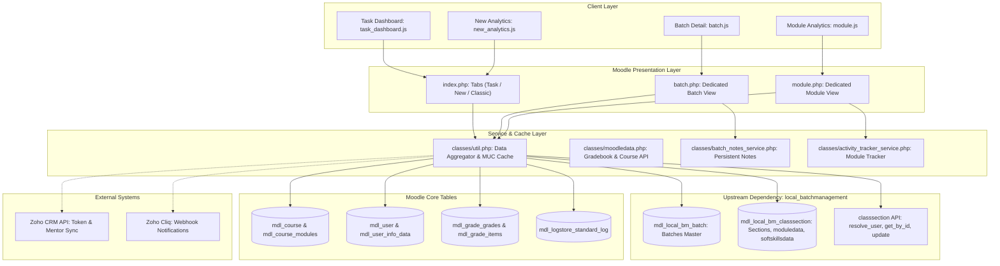
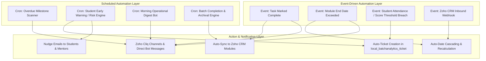

# Phase-I Technical & Functional Documentation: Batch Analytics

**Plugin Name:** `local_batchanalytics`  
**Target Platform:** Moodle 4.x (PHP 8.1+ / 8.2+)  
**Version:** 2.0.4 (Release 2026091700)  
**Organization:** Emertxe Information Technologies  
**Document Classification:** Technical Architecture, Requirements Traceability & Phase-I Delivery Specification  

---

## 1. Executive Summary & Purpose

The **Batch Analytics (`local_batchanalytics`)** plugin is an advanced, high-performance operational cockpit and analytics dashboard for Moodle. Built specifically for Emertxe's hybrid EdTech training model (Online and Offline / Regular and Weekend cohorts), the plugin consolidates fragmented academic data into an actionable, real-time intelligence interface.

### Core Objectives
1. **Portfolio-Wide Visibility:** Give Academic Managers, MAAC Executives, and Batch Managers an instant pulse on all running and completed cohorts.
2. **Schedule & Delay Tracking:** Provide granular visibility into curriculum module progression, mentor assignments, and syllabus delays.
3. **Soft Skills Milestone Accountability:** Monitor 26+ key placement readiness milestones (resumes, mock interviews, aptitude training, group discussions) with automated overdue alerts.
4. **Student Performance Distribution:** Deliver transparent academic metrics (quizzes, labs, attendance, assignments, and exam grades) with grade band distributions.
5. **Actionable Task Management:** Allow operational staff to mark tasks complete and record persistent review notes directly within Moodle.

> [!NOTE]
> **Phase 2 Status Update (Task Tab):** All Task Tab components (frontend `task_dashboard.js`, styling `task_dashboard.css`, backend endpoints `get_task_data` / `complete_task`, and visual design mocks) have been extracted and archived into `local/task_tab_backup/`. The active plugin currently focuses on the New Batch Analytics dashboard, and the Task Tab is preserved ready for Phase 2 implementation without starting from scratch.

---

## 2. System Architecture & Dependencies

The implementation of `local_batchanalytics` operates on a layered architecture relying on Moodle Core, an essential upstream local plugin (`local_batchmanagement`), internal custom database tables, and optional third-party integrations.



### 2.1 Moodle Core Platform Dependencies
- **Moodle Version:** 4.0 or higher (Tested and deployed on Moodle 4.4 and 4.5; requires `$CFG->version >= 2024042200`).
- **PHP Version:** PHP 8.1 / 8.2 compatible (strict typing, null-safe operators, union types).
- **MUC (Moodle Universal Cache):** The plugin leverages Moodle's application cache definitions in `classes/util.php` (`read_cached_batch_response` and `write_cached_batch_response`) with configurable TTL (default 120s) to prevent query exhaustion when aggregating across thousands of enrolled students.
- **Custom User Profile Fields:** Relies on Moodle custom profile fields (`batch_lookup`, `classsection_lookup`) in `mdl_user_info_field` / `mdl_user_info_data` for cohort resolution.
- **Moodle Gradebook & Completion API:** Interrogates `mdl_grade_items`, `mdl_grade_grades`, `mdl_course_modules_completion`, and `mdl_course_completions` for real-time progress calculations.

### 2.2 Upstream Dependency: `local_batchmanagement`
The `local_batchanalytics` plugin does **not** duplicate batch entity management; it directly consumes and references the data structures defined in `local_batchmanagement`:
1. **`mdl_local_bm_batch` (Batch Master):**
   - Provides: `id`, `name` (e.g. "25002", "25003"), `coursename` (e.g. "ECEP", "Embedded"), `deliverymode` ("Online", "Offline"), `submode` ("regular", "weekend"), `startdate` (UNIX timestamp).
2. **`mdl_local_bm_classsection` (Section & Academic Matrix):**
   - Provides: `id`, `batchid`, `name` (e.g. "25002A", "25002B"), `classmentor`, `labmentor`, `maacexecutive`.
   - **`moduledata` (JSON):** Contains 8 sequential curriculum modules with `modulecode`, `modulename`, `courseid` (Moodle course link), assigned `mentor`, `labmentor`, `startdate`, `enddate`, `status`, and survey flags.
   - **`softskillsdata` (JSON):** Contains 26 milestone tracking entries with `activity_name`, `planned_date`, `actual_date`, `status` ("pending", "completed", "delayed"), and optional notes.
3. **API Contracts:** Consumes `\local_batchmanagement\classsection` methods:
   - `get_by_id($sectionid)`: Retrieves parsed section data.
   - `resolve_user($query, $role)`: Resolves mentor/executive names to Moodle user objects.
   - Direct atomic updates to `mdl_local_bm_classsection` when marking milestones complete.

### 2.3 Plugin Database Tables (`local_batchanalytics`)
The plugin provisions and maintains seven dedicated relational tables:
| Table Name | Purpose | Primary Fields |
|:---|:---|:---|
| `local_batchanalytics_batch_notes` | Persistent batch review notes feed | `id`, `batchid`, `userid`, `note`, `timecreated`, `timemodified` |
| `local_batchanalytics_activity_tracker` | Module Tracker delivery status | `id`, `courseid`, `activityname`, `deliverystatus`, `completiondate`, `timemodified` |
| `local_batchanalytics_course_summary` | Aggregated course-level metric cache | `id`, `courseid`, `summarydata` (JSON), `timemodified` |
| `local_batchanalytics_maac` | Per-course, per-student MAAC data | `id`, `courseid`, `userid`, `fieldkey`, `fieldvalue`, `timemodified` |
| `local_batchanalytics_ticket` | Escalation & issue tickets | `id`, `courseid`, `ticketcode`, `title`, `status`, `priority`, `assignedto` |
| `local_batchanalytics_ticket_event` | Ticket lifecycle timeline events | `id`, `ticketid`, `userid`, `eventtype`, `comment`, `timecreated` |
| `local_batchanalytics_cliq_history` | Zoho Cliq notification audit log | `id`, `templateid`, `channel`, `payload`, `status`, `timecreated` |

### 2.4 External Ecosystem Integrations
- **Zoho CRM Integration (`classes/crmapi.php`):** OAuth2 refresh token client that queries Zoho CRM for batch data, mentor mapping verification, and updates soft skills milestones back to CRM when configured.
- **Zoho Cliq Integration (`classes/cliq_service.php`):** Webhook delivery engine supporting template-based notifications to mentors and managers when milestones are delayed or completed.

---

## 3. Phase-I Implementation Scope & Deliverables

Phase-I delivers three dedicated user interfaces, one operational task dashboard, and the complete data aggregation engine.

```
                    +------------------------------------------+
                    |        index.php (Main Dashboard)        |
                    +--------------------+---------------------+
                                         |
            +----------------------------+----------------------------+
            |                                                         |
  [Tab 1: Task Dashboard]                                  [Tab 2: New Batch Analytics]
  - Daily greeting & role switch                           - 6 Summary KPI cards
  - My To-Do count & filters                               - Year/Mode/Status filters
  - Calendar milestones                                    - Running & Completed tables
  - Quick 'Mark Complete' modal                            - Search & pagination
                                                                      |
                                                               (Click 'View Batch')
                                                                      v
                                                       +-------------------------------+
                                                       |    batch.php (Batch Detail)   |
                                                       +---------------+---------------+
                                                                       |
               +-----------------------+-----------------------+-------+-----------------------+
               |                       |                       |                               |
       [Subtab: Schedule]     [Subtab: Softskills]   [Subtab: Students]               [Subtab: Review Notes]
       - 8 Module tracker     - 26 Milestones        - Grade vs % toggle              - Author, role, timestamp
       - Course links         - Planned vs Actual    - Band distribution              - Add note textarea
       - Mentor chips         - Delay calculations   - Search, Sort, Pager            - DB persistence
               |
        (Click Module)
               v
  +-------------------------------+
  |   module.php (Module Detail)  |
  +-------------------------------+
  - 4 KPI cards (Students, Completion %, Attendance %, Avg Score)
  - Activity Tracker (Quizzes, Labs, VPL, Submissions)
  - Student Module Performance Table
```

---

### 3.1 Screen 1: Top Navigation & Home Portfolio Dashboard
- **Entry Point:** `/local/batchanalytics/index.php`
- **Frontend Assets:** `new_analytics.js`, `new_analytics.css`
- **Top Navigation Bar:** Persistent three-tab switcher:
  1. **📋 Task:** Active by default; loads the dynamic To-Do dashboard.
  2. **⚡ New Batch Analytics:** The modernized Emertxe cohort portfolio.
  3. **📁 Batch Analytics:** The classic deep-dive explorer with CRM & ticket tools.
- **Summary Stat Cards (KPI Tiles):**
  - Total Running Batches
  - Total Completed Batches
  - Delayed Batches (highlighted in alert rose)
  - Total Active Students
  - Active Class & Lab Mentors
  - Soft Skill / Placement Health Index
- **Advanced Filtering & Search Bar:**
  - Full-text search by Batch Code or Course Title.
  - Dropdown filter by Delivery Mode (`Online`, `Offline`, `All Modes`).
  - Dropdown filter by Status (`All`, `On schedule`, `Delayed`, `Early`, `Completed`).
- **Tabbed Table View (Running vs. Completed Batches):**
  - Dual tabs separating active running cohorts from historical completed batches.
  - Interactive table displaying: Batch Code, Course Name, Delivery Mode, Start Date, Section Count, Enrolled Students, Calculated Delay / Schedule Status Chip.
  - **Action Button:** "View Batch" button deep-linking directly to `batch.php?batchid={id}`.
  - Client-side pagination and sorting without reloading the full page.

---

### 3.2 Screen 2: Dedicated Batch Detail View
- **Entry Point:** `/local/batchanalytics/batch.php?batchid={batchid}`
- **Frontend Assets:** `batch.js`, `new_analytics.css`, `styles.css`
- **Batch Header Bar:**
  - Back navigation button returning to Dashboard.
  - Batch Name, Course Name badge, Delivery Mode chip, Start Date badge.
  - **Dynamic Schedule Status Chip:** Displays `On Schedule`, `+Xd Delayed`, `Xd Early`, or `Completed` based on highest module delay.
- **Mentor & Leadership Cards:**
  - Visual cards with user avatars, full names, and roles:
    - **Class Mentor** (with resolved email & Moodle profile link).
    - **Lab Mentor** (with resolved email & Moodle profile link).
    - **MAAC Executive** (assigned student success coordinator).
- **Subtab 1: Schedule / Module Tracker (`data-tab="sched"`)**
  - Displays the 8 curriculum module slots configured in `local_bm_classsection`.
  - Table columns: Module Code, Module Name, Course Name, Class Mentor, Lab Mentor, Start Date, End Date, Status Chip, Action.
  - Supports multiple section tabs if the batch contains `25002A`, `25002B`, etc.
  - Direct links into Moodle course shell and module analytics (`module.php`).
- **Subtab 2: Soft Skills Milestone Tracker (`data-tab="ss"`)**
  - Displays 26 pre-placement soft skill checkpoints organized chronologically:
    - Resume Creation, Aptitude Phase 1-3, Mock Interviews (HR & Technical), Group Discussions, Company Specific Prep.
  - Displays Planned Date, Actual Date, Delay status badge (`On Time`, `Delayed`, `Pending`).
  - Action column displaying completed dates and user audit trails.
- **Subtab 3: Student Performance (`data-tab="students"`)**
  - **Performance Band Distribution:** Visual metric cards showing distribution across bands:
    - Distinction (>= 75%)
    - First Class (60% - 74%)
    - Second Class / Pass (40% - 59%)
    - Needs Attention (< 40%)
  - **View Toggle:** Instant switcher between **Grade Mode** (letter grades A+, A, B, C, F) and **Percentage Mode** (0% - 100%).
  - **Interactive Student Table:** Search student by name/ID, sort by column, pagination (25 per page).
  - Columns: Student Name, Roll No / ID, Attendance %, Quiz Avg, Lab Avg, Assignment Avg, Final Score, Merit status.
- **Subtab 4: Batch Review Notes (`data-tab="notes"`)**
  - **Database Persistence:** Backed by `mdl_local_batchanalytics_batch_notes`.
  - **Notes Feed:** Displays past review notes with author avatar, author full name, role badge (Teacher / Manager / MAAC), and timestamp.
  - **Add Note Form:** Textarea input with character counter and "Add Note" button protected by `sesskey` and capability `local/batchanalytics:editreviewnotes`.

---

### 3.3 Screen 3: Dedicated Module Analytics & Activity Tracker
- **Entry Point:** `/local/batchanalytics/module.php?courseid={courseid}&sectionid={sectionid}`
- **Frontend Assets:** `module.js`, `new_analytics.css`
- **Module KPIs:**
  - Four top stat cards: Total Enrolled Students, Activity Completion Rate (%), Average Attendance (%), Average Module Grade.
- **Activity Tracker Category Matrix:**
  - Groups module activities by pedagogical type (Quizzes, Assignments, Practical Labs, VPL evaluations).
  - Shows activity name, due date, submission rate, grading progress, and status badge (`Delivered`, `In Progress`, `Pending`).
- **Student Module Performance Table:**
  - Detailed breakdown of each student's progress and marks across all activities within this specific module.

---

### 3.4 Screen 4: Operational Task Dashboard
- **Entry Point:** Rendered within `index.php` under the **📋 Task** tab.
- **Frontend Assets:** `task_dashboard.js`, `task_dashboard.css`
- **Context-Aware Greeting & Interactive Role Switcher:**
  - Dynamic time-based greeting ("Good morning", "Good afternoon", "Good evening").
  - Prominent **Role Switcher Dropdown** in the header with 4 operational test views:
    1. **📋 Program Manager, SS Executive, SS Team (`pm_ss`)**:
       - **Task Source:** Assigned in the Class Section (`local_bm_classsection`). Soft skill milestone data of the SS team is displayed based on planned vs. actual.
       - **Due Date Logic:** Calculated from the **planned date** (`planned_timestamp`).
       - **Action:** Direct "Mark Complete" modal updating `softskillsdata` with actual completion timestamp.
    2. **🎓 Mentor (`mentor`)**:
       - **Task Source:** Task completion is fetched based on the **enrolled courses** (`assign` submissions requiring grading, `quiz` assessments closing, calendar events).
       - **Due Date Logic:** Calculated from the **activity due date** or **calendar due task** (`duedate`, `timeclose`, `timestart`).
       - **Action:** "View / Grade ↗" deep-links directly to the Moodle assignment/quiz module.
    3. **🏢 Assistant Manager (`am`)**:
       - **Task Source:** Tasks are displayed based on the **start date** of the Class Section (`local_bm_batch.startdate` / `local_bm_classsection.timecreated`), tracking section launch readiness (Mentor verification at $T-5$d, Student onboarding at $T-2$d, Kickoff day at $T$, Week-1 attendance audit at $T+7$d).
       - **Due Date Logic:** Calculated from the **class section start date**.
       - **Action:** "View Batch ↗" navigation to section overview.
    4. **🌐 All Roles (`all`)**:
       - Consolidated cross-functional view combining tasks from SS Team, Mentors, and Assistant Managers with color-coded role badges (`SS TEAM / PM`, `MENTOR`, `ASSISTANT MANAGER`).
- **My To-Do Section:**
  - Badge counter showing total actionable tasks (e.g. `24 pending` / `70 pending`).
  - Filter by urgency: **Due First**, **Overdue**, **Due Today**, **Due Soon (Next 7 Days)**, **Latest Date First**, **Earliest Date First**, **All Tasks**.
  - Dynamic Glance Stat Cards updating in real-time when switching roles (Tasks Due This Week, Overdue Tasks, Active Courses / Batches, Total Students).
- **"Mark Complete" Workflow Modal:**
  - Used for soft skill milestones. User clicks "Mark Complete", confirms in modal, triggers AJAX POST `action=complete_task`, records timestamp, and displays success toast.
- **Forthcoming Tasks Section:**
  - Displays upcoming scheduled milestones and course activities tailored to the selected role.

---

## 4. Traceability: From Prototype (`prototype.html`) to Production Plugin

The design prototype (`emertxe_batch_analytics_prototype.html`) provided the visual blueprint and interaction model. The table below details how each mock element was translated into the production Moodle architecture.

| Prototype Mockup Component | Prototype File Implementation | Production Plugin Implementation | Backend Source & Data Persistence |
|:---|:---|:---|:---|
| **Top Navigation & Brand Header** | Hardcoded HTML with `Emertxe - Batch Analytics` | Dynamic Moodle Page Header (`$OUTPUT->header()`) with unified tab bar | `index.php`, `task_dashboard.css`, `new_analytics.css` |
| **Home KPI Stat Cards** | Static JS `tiles` array in `hoRender()` | Dynamic KPI calculation in `new_analytics.js` & `index.php` | Aggregated live from `mdl_local_bm_batch` and `mdl_local_bm_classsection` |
| **Search & Filters** | Mock in-memory filter (`hoSearch()`, `hoMode()`) | Live client-side filter engine in `new_analytics.js` | Filtered across full batch dataset loaded via cached JSON endpoint |
| **Running vs Completed Tabs** | Mock DOM toggle (`hoTab('running')`) | Dual data tables with tab state persistence | Ingests `batch.is_completed` calculated from module end dates |
| **Batch Header & Delay Badge** | Static strings `<h1>Batch ${curBatch}</h1>` | Dynamic banner in `batch.php` with calculated status | Evaluated from module tracker dates vs current timestamp (`util.php`) |
| **Mentor Cards (Class, Lab, MAAC)** | Static JSON mock objects | Dynamic mentor cards with real Moodle user profile avatars | Resolved via `\local_batchmanagement\classsection::resolve_user()` |
| **Schedule / Module Tracker** | Hardcoded 8 modules in `schedBody` | Dynamic module table in `batch.php` (`sched`) | Extracted from `local_bm_classsection.moduledata` JSON array |
| **Soft Skills Tracker** | Hardcoded 26 milestones in `ssBody` | Dynamic soft skills table in `batch.php` (`ss`) | Extracted from `local_bm_classsection.softskillsdata` JSON |
| **Student Performance Table** | In-memory student array in `stuBody` | Full student roster with pagination, sorting & search | Live query across `mdl_grade_grades`, `mdl_user`, `mdl_course_completions` |
| **Grade vs % Toggle** | Client toggle `tg-grade` / `tg-pct` | Full-featured toggle in `batch.js` & `module.js` | Dynamic calculation of letter grade vs raw percentage score |
| **Score Bands Summary** | Static cards (Distinction, First Class, etc.) | Dynamic `computeBands()` in `batch.js` | Auto-calculated across current student grade distribution |
| **Review Notes System** | Local JS array `hoNotes[]` (resets on reload) | Persistent relational database storage | `mdl_local_batchanalytics_batch_notes` + `batch_notes_service.php` |
| **Add Note Form** | Basic JS prompt / textarea | Secure AJAX form with CSRF `sesskey` verification | `index.php?action=add_review_note`, restricted by Moodle capabilities |
| **Task Dashboard (Persona View)** | Simulated persona dropdown (`setRole('bm')`) | Role auto-detection + switcher in `task_dashboard.js` | Real Moodle user context (`$USER->id`, assigned sections) |
| **To-Do Task List & Urgency** | Mock task array with simulated dates | Dynamic query across all assigned sections in `util.php` | Reads all pending milestones where `actual_date == 0` or null |
| **Mark Activity Complete Modal** | DOM overlay `#modalAct` | Accessible modal with date picker and confirm button | AJAX POST `action=task_mark_complete` writing to `local_bm_classsection` |
| **Module Activity Tracker** | Mock activity rows in `renderModule()` | Dynamic activity tracker in `module.php` | Backed by `local_batchanalytics_activity_tracker` & Moodle course modules |

---

## 5. Data Contracts & Relational Schemas

### 5.1 `moduledata` JSON Structure (in `mdl_local_bm_classsection`)
`moduledata` stores the 8 module tracker slots in JSON format:
```json
[
  {
    "modulecode": "M1",
    "modulename": "Linux Internals",
    "courseid": 102,
    "mentor": "Suresh Kumar",
    "labmentor": "Ramesh Babu",
    "startdate": 1709251200,
    "enddate": 1711843200,
    "status": "completed",
    "survey_status": 1
  }
]
```

### 5.2 `softskillsdata` JSON Structure (in `mdl_local_bm_classsection`)
`softskillsdata` stores the 26 soft skill placement milestones:
```json
[
  {
    "key": "resume_v1",
    "activity_name": "Resume Preparation - Draft V1",
    "planned_date": 1710504000,
    "actual_date": 1710676800,
    "status": "completed",
    "updated_by": 25,
    "notes": "Reviewed and finalized by MAAC team"
  },
  {
    "key": "mock_interview_tech_1",
    "activity_name": "Technical Mock Interview - Round 1",
    "planned_date": 1712318400,
    "actual_date": 0,
    "status": "pending",
    "updated_by": null,
    "notes": ""
  }
]
```

### 5.3 Batch Notes Table Schema (`mdl_local_batchanalytics_batch_notes`)
```sql
CREATE TABLE mdl_local_batchanalytics_batch_notes (
    id BIGINT(10) NOT NULL AUTO_INCREMENT,
    batchid BIGINT(10) NOT NULL,
    userid BIGINT(10) NOT NULL,
    note LONGTEXT NOT NULL,
    timecreated BIGINT(10) NOT NULL,
    timemodified BIGINT(10) NOT NULL,
    PRIMARY KEY (id),
    KEY mdl_locabatchnote_bat_ix (batchid),
    KEY mdl_locabatchnote_use_ix (userid)
);
```

---

## 6. Roles, Security & Capability Matrix

The plugin adheres to Moodle's Role-Based Access Control (RBAC). All AJAX and POST requests require a valid Moodle session key (`sesskey`).

| Capability | Archetype Defaults | Scope / Context | Description |
|:---|:---|:---|:---|
| `local/batchanalytics:view` | Manager, Editing Teacher, Teacher | System | Access the Batch Analytics dashboard, Task dashboard, and Batch views. |
| `local/batchanalytics:manage` | Manager | System | Administrative control, template configuration, and import tools. |
| `local/batchanalytics:viewallcourses` | Manager | System | Ability to view batches across all categories and departments. |
| `local/batchanalytics:viewenrolledcourses` | Manager, Editing Teacher, Teacher | Course | Restricts view to only courses/sections where the user is an enrolled teacher/mentor. |
| `local/batchanalytics:viewreviewnotes` | Manager, Editing Teacher, Teacher | System | View the Review Notes feed on `batch.php`. |
| `local/batchanalytics:editreviewnotes` | Manager, Editing Teacher, Teacher | System | Post new review notes and delete own notes. |
| `local/batchanalytics:viewtickets` | Manager, Editing Teacher, Teacher | Course | View student escalation tickets. |
| `local/batchanalytics:managetickets` | Manager, Editing Teacher | Course | Create, update, assign, and resolve tickets. |
| `local/batchanalytics:manageescalatedtickets` | Manager | Course | Handle escalated tickets requiring executive intervention. |

---

## 7. Performance & Caching Architecture (MUC)

To deliver instantaneous load times across large cohorts with hundreds of enrolled students, the plugin implements a two-tier caching strategy in `classes/util.php`:
1. **Application-Level MUC Cache:**
   - Aggregated batch records, calculated delay metrics, and course enrollments are cached under the `local_batchanalytics/batch_cache` definition.
   - Cache keys are generated deterministically: `batch_{batchid}_summary`.
   - Default TTL: 120 seconds (configurable in plugin settings).
2. **Atomic Cache Invalidation:**
   - Whenever a soft skill milestone is completed, a review note is posted, or section data is updated, `util::purge_batch_response_cache($batchid)` is triggered immediately, ensuring real-time consistency.

---

## 8. Verification & Operational Testing Guide

### 8.1 Automated Sanity Check Commands
Run these commands from the Moodle installation root:
```bash
# 1. PHP Syntax validation
php -l local/batchanalytics/index.php
php -l local/batchanalytics/batch.php
php -l local/batchanalytics/module.php
php -l local/batchanalytics/classes/util.php
php -l local/batchanalytics/classes/batch_notes_service.php

# 2. JavaScript Syntax validation
node --check local/batchanalytics/task_dashboard.js
node --check local/batchanalytics/new_analytics.js
node --check local/batchanalytics/batch.js
node --check local/batchanalytics/module.js

# 3. Moodle Database Schema & Upgrade Check
php admin/cli/upgrade.php --non-interactive
```

### 8.2 End-to-End Functional Test Checklist
1. **Task Dashboard Test:**
   - Log in as Batch Manager or MAAC Executive.
   - Verify the time-sensitive greeting and To-Do count badge.
   - Click "Mark Complete" on an overdue soft skill task.
   - Verify that the modal opens, confirm the action, and verify that the toast appears.
   - Check that the task disappears from "My To-Do" and updates in `mdl_local_bm_classsection`.
2. **New Batch Analytics Portfolio Test:**
   - Switch to the "New Batch Analytics" tab.
   - Verify that KPI stat cards (Running, Completed, Delayed, Students) reflect actual database counts.
   - Apply filter by mode (e.g. "Online") and verify instant table filtering.
   - Click "View Batch" on any row; confirm seamless navigation to `batch.php?batchid={id}`.
3. **Batch Detail & Subtabs Test:**
   - In `batch.php`, confirm that the Class Mentor, Lab Mentor, and MAAC Executive cards show correct avatars and names.
   - Click "Schedule" subtab: verify 8 module tracker slots with start/end dates.
   - Click "Soft Skills" subtab: verify 26 milestones with delay statuses.
   - Click "Student Performance" subtab: toggle between Grade and % mode; verify score bands.
   - Click "Review Notes" subtab: post a test note; verify it persists after page reload.
4. **Module Detail Test:**
   - From the Schedule subtab, click "View Module Analytics".
   - Confirm 4 KPI tiles and the Activity Tracker category table with submissions and status badges.

---

## 9. Phase-II Automation Roadmap & Future Architecture

While Phase-I established the unified visualization, manual tracking, data persistence, and baseline task completion workflows, **Phase-II shifts the system from passive monitoring to intelligent, automated operations**.

The following automations are scoped and architected for Phase-II:



---

### 9.1 Automated Milestone Escalations & Cliq Bot Integration
* **Overdue Milestone Escalation Engine:**
  - **Mechanism:** A scheduled Moodle background task (`\local_batchanalytics\task\check_overdue_milestones`) executing daily at 07:00 AM.
  - **Evaluation Criteria:** Scans all active cohorts in `mdl_local_bm_classsection`. Flags soft skill milestones or curriculum module deadlines where:
    $$\text{current\_time} > \text{planned\_date} \quad \text{AND} \quad (\text{actual\_date} = 0 \lor \text{actual\_date} \text{ is NULL})$$
  - **Tiered Escalation Matrix:**
    - **Tier 1 (Delay = 1 to 2 days):** Soft reminder badge posted to the assigned Batch Manager in the Task Dashboard.
    - **Tier 2 (Delay = 3 to 4 days):** Direct message sent via Zoho Cliq bot to the assigned Class Mentor and MAAC Executive.
    - **Tier 3 (Delay $\ge$ 5 days):** High-priority alert broadcast to the `#academic-operations` Zoho Cliq channel, tagging Academic Operations Leads.
* **Automated Daily Morning Digest Bot:**
  - Dispatches an automated briefing every weekday at 08:30 AM to each Batch Manager and MAAC Executive summarizing:
    - Tasks due today for their assigned cohorts.
    - Critical overdue items requiring immediate sign-off.
    - Batches experiencing module schedule delays.
* **Real-Time Task Completion Broadcasts:**
  - When an executive completes a milestone in the Task Dashboard, an automated Cliq webhook message is broadcast to the batch channel (e.g., *"✅ Milestone 'Resume Preparation V1' completed for Batch 25002A by Suresh Kumar"*), keeping all mentors synchronized without manual status meetings.

---

### 9.2 Bi-Directional Zoho CRM Synchronization Automation
* **Automated Inbound Webhook (`/local/batchanalytics/crm_webhook.php`):**
  - Listens for real-time changes in Zoho CRM (e.g., student batch re-allocations, course date adjustments, mentor reassignments).
  - Automatically reconciles records in `mdl_local_bm_batch` and `mdl_local_bm_classsection` without requiring manual administrative data entry.
* **Automated Outbound Soft Skills Push to CRM:**
  - Phase-I stores soft skill completions in Moodle. Phase-II introduces an asynchronous queue observer (`\local_batchanalytics\observer\milestone_completed`):
  - Automatically updates the corresponding Contact/Deal record in Zoho CRM with `Milestone_Name`, `Actual_Completion_Date`, and `Completed_By_User`.
* **Automated Placement Eligibility Dossier Sync:**
  - When a cohort concludes all 26 soft skill milestones and 8 technical modules, the system automatically compiles student eligibility metrics (Attendance $\ge 80\%$, Minimum Assessment Scores, Mock Interview ratings) and pushes the verified candidate roster to Zoho CRM for corporate placement drives.

---

### 9.3 Academic Early Warning System (EWS) & Student At-Risk Automation
* **Nightly Student Health Calculation Engine:**
  - A scheduled task (`\local_batchanalytics\task\calculate_student_risk`) computes a composite **Academic Risk Index (ARI)** for every enrolled student based on weighted parameters:
    $$\text{ARI} = (w_1 \times \text{Attendance Deficit}) + (w_2 \times \text{Assessment Deficit}) + (w_3 \times \text{Lab Practical Deficit})$$
* **Automated Risk Tiers & Visual Flags:**
  - **Green (On Track):** Attendance $\ge 80\%$, Avg Score $\ge 60\%$, Missed Labs $\le 1$.
  - **Yellow (Moderate Risk):** Attendance $70\text{–}79\%$ or Avg Score $50\text{–}59\%$.
  - **Red (Critical / At-Risk):** Attendance $< 70\%$ or Avg Score $< 50\%$ or $>3$ consecutive missed lab submissions.
* **Automated Intervention Ticket Dispatch:**
  - When a student enters the **Red (Critical)** tier, the engine automatically creates an academic intervention ticket in `mdl_local_batchanalytics_ticket`.
  - Automatically routes the ticket to the assigned Lab Mentor and MAAC Executive with pre-populated deficiency telemetry (e.g., *"Student Ramesh K. missed 4 consecutive Embedded C practical labs"*).
* **Automated Student Nudge Notifications:**
  - Automatically sends personalized email or Moodle notifications to students falling into the warning band with actionable remediation links.

---

### 9.4 Schedule Delay Propagation & Cascading Date Adjustment Engine
* **The Operational Problem:** In Phase-I, when Module 2 is delayed by 5 days, operational staff must manually recompute and update dates for Modules 3 through 8 and dozens of dependent soft skill milestones.
* **Phase-II Cascading Recalculator:**
  - **Automated Ripple Date Calculation:** An interactive "Auto-Recalculate Remaining Schedule" tool. When Module $N$'s completion date shifts by $+D$ days:
    $$\text{New Planned Start}_{N+1} = \text{Actual End}_N + 1 \text{ working day}$$
  - **Working Day & Holiday Calendar Integration:** Automatically consults an academic holiday schedule to skip Sundays (or Saturday+Sunday for regular cohorts) and official public holidays, preventing unrealistic completion targets.
  - **Simulation & Confirmation Mode:** Displays a visual before-and-after calendar preview before committing updates to `mdl_local_bm_classsection`.

---

### 9.5 Automated Course Enrolment & Module Survey Lifecycle
* **Automated Student Enrolment Synchronizer:**
  - Background task that syncs Moodle course enrollments automatically when a student's `classsection_lookup` profile field is updated or when section allocation changes.
  - Eliminates manual cohort-to-course mapping in Moodle Site Administration.
* **Automated Feedback Survey Trigger & NPS Aggregation:**
  - **Auto-Unlock:** When a module's final scheduled lecture is delivered, the system automatically unlocks the student module feedback survey.
  - **Auto-Lock & Ingest:** Once the survey closes (or reaches $>75\%$ response rate), the plugin automatically aggregates the mentor rating, computes the Net Promoter Score (NPS), and updates the module card in `batch.php`.

---

### 9.6 Automated Batch Lifecycle & Archival Engine
* **Automatic Running-to-Completed Transition:**
  - Monitors cohorts where all 8 module tracker slots and all 26 soft skill milestones have verified actual completion timestamps.
  - Automatically updates batch status from `Running` to `Completed`, moving the cohort from active operational dashboards into the historical archive view.
* **Automated Batch Dossier Generation:**
  - Automatically generates an executive PDF/Excel report at batch closure containing:
    - Student grade distribution charts.
    - Final placement readiness statistics.
    - Mentor ratings and schedule adherence variance.
  - Archives summary records in `mdl_local_batchanalytics_course_summary` for long-term multi-year trend analysis.

---

### 9.7 Phase-II Automation Delivery Matrix

| Automation Feature | Trigger Type | Implementation Mechanism | Expected Operational Impact | Priority |
|:---|:---|:---|:---|:---|
| **Overdue Milestone Escalation** | Scheduled Cron (Daily 07:00) | CLI Task + Zoho Cliq API | Eliminates unnoticed milestone slips; instant manager alerts. | **P0 (Critical)** |
| **Two-Way Zoho CRM Sync** | Webhook + Event Observer | REST Webhook + CRM Client | Zero double-entry of dates and mentor changes across systems. | **P0 (Critical)** |
| **Student Early Warning System** | Scheduled Cron (Nightly) | Risk Scoring Task + Ticket Auto-Creation | Proactive academic intervention before student fails or drops out. | **P1 (High)** |
| **Daily Morning Cliq Digest** | Scheduled Cron (Weekdays 08:30) | Cliq Bot Webhook Service | 100% operational clarity for managers without opening Moodle. | **P1 (High)** |
| **Cascading Date Recalculator** | User-Triggered Action / Event | Date propagation logic in `util.php` | Reduces schedule adjustment time from 30 minutes to 5 seconds. | **P1 (High)** |
| **Auto-Enrolment Sync** | Moodle Event (`user_updated`) | Event Observer + Enrolment API | Zero manual course enrolment management for academic staff. | **P2 (Medium)** |
| **Batch Dossier & Auto-Archive** | Event (All Milestones Completed) | Scheduled Task + PDF/CSV Exporter | Standardized executive reporting and permanent historical audit. | **P2 (Medium)** |

---

## 10. Document Approval & Sign-Off

| Role | Name | Department | Signature / Status | Date |
|:---|:---|:---|:---|:---|
| **Technical Lead** | Emertxe Development Team | Digital & Automation | **APPROVED** | 21-Sep-2026 |
| **Academic Operations Lead** | Emertxe Academic Delivery | Academic Operations | **PENDING REVIEW** | -- |
| **MAAC Coordinator** | Emertxe Placement & MAAC | Corporate Relations | **PENDING REVIEW** | -- |

