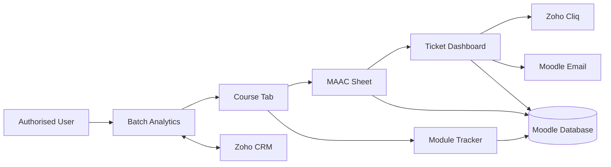
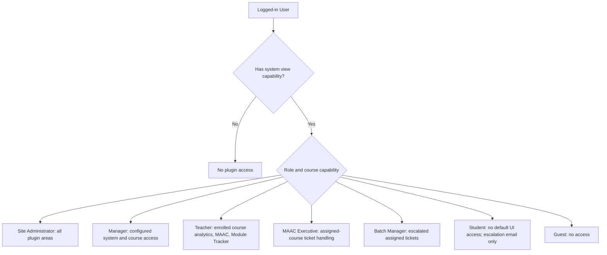
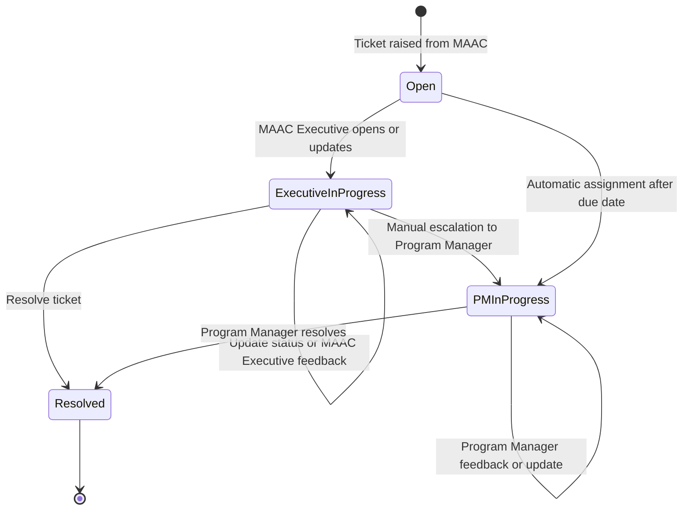
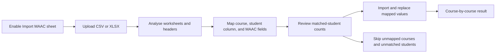
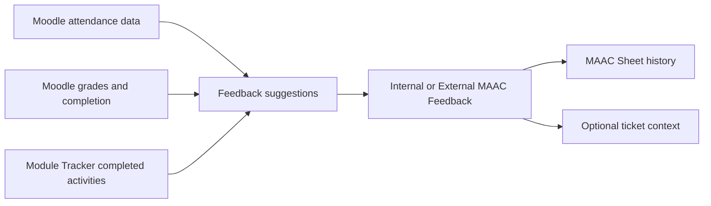

# Batch Analytics

`local_batchanalytics` is a Moodle local plugin for batch-level course analytics, MAAC data, activity delivery tracking, ticket handling, and optional Zoho CRM and Zoho Cliq integrations.

Current release: `2.0.5` | Plugin version: `2026080300`

## Contents

- [Requirements](#requirements)
- [Installation and Upgrade](#installation-and-upgrade)
- [Configuration](#configuration)
- [Workflow Diagrams](#workflow-diagrams)
- [Plugin Areas](#plugin-areas)
- [Role Workflows](#role-workflows)
- [Ticket Workflow](#ticket-workflow)
- [MAAC Import Workflow](#maac-import-workflow)
- [Data Storage](#data-storage)
- [Scheduled Tasks](#scheduled-tasks)
- [Access and Security](#access-and-security)
- [Technical Reference](#technical-reference)
- [Deployment Validation](#deployment-validation)

## Requirements

### Required

- Moodle `4.4` or later (`$plugin->requires = 2024042200`).
- A PHP version supported by the installed Moodle release.
- Moodle cron enabled. It is required for automatic overdue-ticket escalation and Cliq history retention.
- User roles and capabilities configured for the required workflows.

### Optional Integrations

- **Zoho CRM**: required only for CRM student data, mentor data, CRM filters, MAAC-to-CRM sync, and CRM CSV export.
  - Zoho OAuth client ID, client secret, and refresh token.
  - Zoho Accounts URL and API base URL appropriate for the Zoho data centre.
  - Student CRM module API name and field configuration.
- **Zoho Cliq**: required only for Cliq ticket notifications.
  - Cliq bot URL and bot key.
  - Configured Cliq templates.
- **XLSX MAAC import**: requires `PhpOffice\PhpSpreadsheet\IOFactory` to be available to Moodle's PHP runtime. CSV import does not need PhpSpreadsheet.

### Browser and File Limits

- The MAAC importer accepts `.xlsx` and `.csv` files only.
- The maximum uploaded import file size is `10 MB`.

## Installation and Upgrade

1. Copy the plugin directory to `moodle/local/batchanalytics`.
2. Sign in as a site administrator.
3. Open **Site administration > Notifications** and complete the Moodle plugin installation or upgrade.
4. Purge caches if Moodle does not immediately load the new navigation, language strings, JavaScript, or styles.
5. Open **Site administration > Plugins > Local plugins > Batch Analytics** and complete the required configuration.
6. Assign plugin capabilities and configure the MAAC Executive and Batch Manager roles.
7. Confirm Moodle cron is running.

Do not skip the Moodle upgrade after deploying a new version. Schema changes, including ticket feedback fields and activity tracker storage, are applied through `db/upgrade.php`.

## Configuration

Open **Site administration > Plugins > Local plugins > Batch Analytics**. Settings require `moodle/site:config`.

### Zoho and CRM

- Enter Zoho OAuth credentials and the Accounts/API URLs.
- Configure **Allowed course keywords**. Only matching courses are included in Batch Analytics grouping and search.
- Configure the student CRM module API name and the student CRM fields shown by the plugin.
- Mark CRM fields as restricted when they must not be exposed to non-manager users.
- Configure the mentor CRM module, batch field, fields, and optional mentor field groups when Mentor Details is used.

### MAAC Sheet

- Create MAAC custom columns and column groups.
- Configure standard input columns, feedback columns, formula columns, and CRM-sync columns as required by the batch process.
- Formula columns can refer to configured column variables and the default MAAC Rating. Formula values are rounded to two decimal places.
- Configure feedback duration, trend window, and attendance window values used by the MAAC views and suggestions.
- A custom column selected for **MAAC sync** is included in Batch Overview MAAC Metrics and can be sent to its configured CRM field.

### Module Tracker

- Configure Module Tracker categories.
- Each category has a display name and a comma-separated list of matching Moodle gradebook category names.
- Configure names that reflect your gradebook, such as `assignment, assignments, lab assignment`, `test, quiz`, or `project, projects`.

### Roles and Tickets

- Select the Moodle course role used as the **MAAC Executive role**.
- Select the Moodle course role used as the **Batch Manager role**.
- Configure ticket duration and the creator edit window.
- Configure Ticket Templates for ticket content and suggestions.

### Cliq and Import

- Configure Cliq bot credentials and message templates only when Cliq delivery is required.
- Set Cliq history retention days. The scheduled pruning task deletes older delivery history.
- Enable **Import MAAC sheet** to make the manager-only import workflow available.

Keep secrets in Moodle settings. Do not store OAuth credentials, bot keys, refresh tokens, or CRM data in source control or documentation.

## Workflow Diagrams

### Plugin Architecture

**Text alternative:** An authorised user accesses Batch Analytics and course data, then uses MAAC Sheet, Module Tracker, and Ticket Dashboard. The plugin stores its data in Moodle, optionally reads and syncs CRM data with Zoho CRM, sends ticket notifications through Zoho Cliq, and uses Moodle email for student escalation notifications.

### Role Access Flow

**Text alternative:** `local/batchanalytics:view` is the initial gate. Course capabilities then determine MAAC and Module Tracker access. MAAC Executive and Batch Manager role mappings grant their ticket workflows but do not grant MAAC access by themselves.

### Ticket Lifecycle

**Text alternative:** A ticket starts open. The MAAC Executive can update, resolve, or escalate it. Overdue tickets can be automatically assigned to the Program Manager by cron. The Program Manager can update and resolve escalated tickets. The timeline records each action, including automatic assignment.

### MAAC Import Diagram

**Text alternative:** A manager enables and opens Import MAAC, uploads a CSV or XLSX file, analyses it, maps only the required courses and fields, reviews student matches, and imports. Unmapped courses and unmatched students are skipped. Existing values are overwritten only for mapped fields and matched students.

### MAAC Feedback Data Flow

**Text alternative:** Feedback suggestions use attendance, grades, completion, and class activities marked complete in Module Tracker. A user can add a suggestion to MAAC feedback, edit it, save it as internal or external feedback, and use the MAAC context when raising a ticket.

## Plugin Areas

### Batch Analytics

The main **Batch Analytics** page lets authorised users:

- Select a batch group and browse its courses.
- View Batch Overview metrics, MAAC Metrics, course metrics, overall performance distribution, mentor details, and course summaries.
- Open individual course tabs with student records and Advanced Filter.
- View CRM data when Zoho CRM is configured.
- Export permitted CRM/filter results to CSV.
- Create or edit a course summary when they have the required MAAC edit access.
- Start MAAC import from Batch Overview when import is enabled and the user has system management access.

### MAAC Sheet

Each eligible course has a **MAAC Sheet** navigation option. It provides:

- Per-student MAAC values and configured custom columns.
- Formula-column values and MAAC Rating.
- Group filtering and the course-style Advanced Filter controls.
- Internal and external multi-feedback records, including multiline feedback display.
- Feedback suggestions based on recent attendance and completed Module Tracker activities.
- Ticket raising, ticket viewing, and creator-limited ticket editing.
- MAAC Metrics visibility and CRM sync for configured MAAC-sync columns.

### Module Tracker

Each eligible course has a **Module Tracker** navigation option. It shows configured gradebook activity categories and allows authorised users to:

- Mark an activity as completed by the class.
- Enter its completion date.
- Automatically populate today's date when completion is checked and no date already exists.
- View completed and pending activity counts by category.

Module Tracker data is used by MAAC feedback suggestions to compare class-delivered activities with student completion.

### Ticket Dashboard

The Ticket Dashboard provides course-level and ticket-level views with batch, course, assignee, and status filters. It supports:

- Ticket status and priority updates.
- Escalation to the configured Batch Manager/Program Manager flow.
- A timeline that records ticket actions and status changes.
- Separate stored feedback values for the MAAC Executive and Program Manager, displayed together under one **Feedback** section.
- Ticket notification delivery and Cliq delivery history where configured.

## MAAC Import Workflow

When enabled, **Import MAAC** appears in Batch Overview for users with `local/batchanalytics:manage`.

- Upload a CSV or XLSX file.
- Analyse worksheets and headers.
- Map zero or more selected courses to worksheets.
- For each mapped course, choose the student identifier column and map MAAC fields to sheet columns.
- Review matched-student counts before import.
- Unmatched or missing student identifiers are skipped and reported; they do not stop a valid import.
- Imported values overwrite existing values only for mapped fields and matched students in that course.
- Feedback-cell lines are imported as sequential feedback entries. Week prefixes such as `W1 -` are removed and missing week numbers do not create gaps.

## Role Workflows

Effective access is controlled by Moodle capability assignments and overrides. The following workflows describe the default plugin behavior after the relevant capabilities and role settings are configured.

### Site Administrator

1. Install or upgrade the plugin through **Notifications**.
2. Configure CRM, Cliq, MAAC columns, Module Tracker categories, ticket settings, import, and role mappings.
3. Assign or review capabilities for custom roles.
4. Use Batch Analytics, MAAC, Module Tracker, Ticket Dashboard, templates, import, CRM sync, and Cliq history without course restrictions.
5. Monitor scheduled tasks, Moodle logs, CRM availability, notification delivery, and upgrade status.

### Manager

1. Open Batch Analytics and search or select permitted batches and courses.
2. Review Batch Overview, MAAC Metrics, Course Metrics, CRM Data, Mentor Details, and individual course tabs.
3. Maintain MAAC data and course summaries where `editmaac` or system `manage` is granted.
4. Configure or use CRM sync and, when enabled, import MAAC data from Batch Overview.
5. View and manage tickets where ticket capabilities are granted.

System `local/batchanalytics:manage` grants full plugin access. Without it, a Manager follows their explicit system and course capability assignments.

### Teacher and Editing Teacher

1. Open Batch Analytics for enrolled and permitted courses.
2. Use the course navigation **MAAC Sheet** and **Module Tracker**.
3. Review or edit MAAC values, add feedback, record activity completion, and create a course summary when `editmaac` is available.
4. Raise tickets from the MAAC Sheet for a student.
5. View all tickets for that student from MAAC; edit only tickets they created while the configured edit window and open-status rules allow it.
6. Use Ticket Dashboard actions only when the corresponding ticket capabilities are granted.

The default archetype grants `view`, `viewenrolledcourses`, `viewmaac`, `editmaac`, `viewtickets`, and `managetickets` to Teacher and Editing Teacher roles. Site capability overrides can change this.

### MAAC Executive

1. Be assigned to the configured MAAC Executive Moodle role in the course.
2. Open Ticket Dashboard for assigned courses.
3. Review raised tickets, update priority or status, and add MAAC Executive feedback.
4. Escalate a ticket to the Program Manager when required. The escalation records the actor in the timeline.
5. If a ticket exceeds the configured duration, Moodle cron can automatically assign it to the Program Manager and records that automatic assignment in the timeline.

MAAC Executive users do not receive MAAC Sheet or Module Tracker access by role mapping alone. Grant `viewmaac` or `editmaac` separately when that access is required.

### Batch Manager / Program Manager

1. Be assigned to the configured Batch Manager Moodle role in the course.
2. Open Ticket Dashboard for assigned courses.
3. Review tickets escalated to the Program Manager.
4. Add Program Manager feedback and resolve the escalated ticket.
5. Review MAAC Executive feedback in the shared **Feedback** section before resolving.

Batch Managers cannot escalate tickets. They can resolve only tickets that have been escalated to them, unless they also hold broader ticket capabilities.

### Student

- Students have no default Batch Analytics, MAAC Sheet, Module Tracker, or Ticket Dashboard access.
- A student can receive the configured Moodle email notification when their ticket is manually escalated to the Program Manager.

### Guest

- Guests do not see Batch Analytics navigation.
- Login-required plugin pages and actions are unavailable.

## Ticket Workflow

1. A user with MAAC edit or ticket-management permission raises a ticket from the student's MAAC Sheet.
2. The ticket is assigned to the configured MAAC Executive and is visible to users who can access that student's MAAC ticket history.
3. The MAAC Executive can update the ticket, add feedback, or escalate it to the configured Batch Manager/Program Manager.
4. On manual escalation, the student receives the configured Moodle email notification. Cliq notifications are sent when Cliq is configured.
5. The Program Manager can add Program Manager feedback and resolve escalated tickets.
6. The ticket timeline records creation, edits, status changes, escalation, automatic overdue assignment, feedback updates, and resolution.

See [notification.md](notification.md) for current notification recipients and [access.md](access.md) for ticket permissions.

## Data Storage

The plugin uses Moodle core data and these plugin tables:

| Table | Purpose |
| --- | --- |
| `local_batchanalytics_maac` | Per-course, per-student MAAC custom-field values. |
| `local_batchanalytics_ticket` | Ticket ownership, routing, priority, status, escalation, MAAC Executive feedback, Program Manager feedback, and resolution data. |
| `local_batchanalytics_ticket_event` | Ticket timeline events. |
| `local_batchanalytics_cliq_history` | Cliq delivery attempts, responses, and errors. |
| `local_batchanalytics_activity_tracker` | Class activity completion status and dates by course module. |
| `local_batchanalytics_course_summary` | Per-course Batch Analytics summaries. |

## Scheduled Tasks

Moodle cron must run these plugin tasks:

| Task | Schedule | Purpose |
| --- | --- | --- |
| `local_batchanalytics\task\auto_assign_tickets_to_pm` | Every 30 minutes | Escalates overdue tickets to the Program Manager flow. |
| `local_batchanalytics\task\prune_cliq_history` | Daily at 02:17 | Deletes Cliq history older than the configured retention period. |

Cliq delivery itself is queued as an adhoc task so ticket writes are not blocked by notification network latency.

## Access and Security

All plugin pages require authentication. Guests are excluded from navigation and protected pages.

- System capability `local/batchanalytics:view` is the plugin entry gate.
- Course-level `viewmaac` or `editmaac` is required for the course navigation items **MAAC Sheet** and **Module Tracker**.
- Module Tracker editing requires `editmaac` or system `manage`.
- Batch Analytics searches and course access are scoped by the user's capabilities and permitted courses.
- Ticket actions apply their own course, role, assignment, status, and escalation checks.
- POST actions require Moodle's `sesskey`.
- CRM field visibility can be restricted for non-manager users.
- MAAC import requires system `local/batchanalytics:manage` and the import setting to be enabled.

See [access.md](access.md) for the complete capability reference and role matrix.

## Technical Reference

### Main Pages

| File | Purpose |
| --- | --- |
| `index.php` | Main Batch Analytics dashboard listing active and completed cohorts with filters and KPIs. |
| `batch.php` | Batch detail view with Schedule, Module Tracker, Student Performance, MAAC, and CRM data tabs. |
| `module.php` | Single-module analytics with student grade distributions, category scores, and final grades. |
| `maac.php` | MAAC Sheet UI, MAAC data actions, feedback, and MAAC ticket actions. |
| `activity_tracker.php` | Module Tracker UI and activity-status actions. |
| `tickets.php` | Ticket Dashboard, updates, resolution, and escalation actions. |
| `maac_import.php` | Manager-only MAAC import analyse, review, and import actions. |
| `ticket_templates.php` | Ticket template administration. |
| `cliq_templates.php` | Cliq template administration. |
| `cliq_message_history.php` | Cliq delivery history administration. |

### Important Classes

| Class/File | Responsibility |
| --- | --- |
| `classes/moodledata.php` | Capability-aware Moodle course, enrolment, grade, and batch data. |
| `classes/maac_service.php` | MAAC aggregation and persistence, ticket workflow, feedback, CRM sync, and access checks. |
| `classes/activity_tracker_service.php` | Module Tracker activity discovery and completion persistence. |
| `classes/crmapi.php` | Zoho CRM authentication, lookup, and update client. |
| `classes/cliq_service.php` | Cliq template rendering, delivery, and history recording. |
| `classes/task/` | Scheduled and adhoc task implementations. |
| `db/install.xml`, `db/upgrade.php` | Database schema and upgrade steps. |

### UI Actions

The UI uses page actions internally. They are not a public API and request/response payloads can change with the UI.

- `index.php`: cohort overview data (`getnewbatchdata`) and PTF CRM data (`getptfdata`).
- `batch.php`: batch overview, section schedule, CRM data, review notes, and status updates.
- `module.php`: module metrics, student grade aggregation, and feedback formatting.
- `maac.php`: summary, MAAC data, MAAC save, ticket raise, and ticket edit actions.
- `activity_tracker.php`: activity data retrieval and save actions.
- `tickets.php`: ticket list, ticket view, update, and escalation actions.
- `maac_import.php`: file analysis, import review, and import actions.

Authenticated requests still require the relevant capability checks and, for state-changing actions, a valid `sesskey`.

## Deployment Validation

After deployment or upgrade, verify the following in the target Moodle environment:

1. **Upgrade**: Site administration notifications completes without XMLDB or version errors.
2. **Navigation**: a permitted teacher sees Batch Analytics, MAAC Sheet, and Module Tracker only for authorised courses.
3. **Capabilities**: MAAC Executive and Batch Manager users see only their intended ticket actions; students and guests cannot access plugin data.
4. **MAAC**: create, edit, cancel, save, and view custom, formula, and multi-feedback values.
5. **Module Tracker**: mark an activity completed, confirm today's date is filled when blank, then verify that MAAC suggestions use tracked activities.
6. **Tickets**: raise, update, escalate, resolve, check the timeline, and verify MAAC Executive and Program Manager feedback appear in one Feedback section.
7. **Notifications**: verify configured Cliq messages and manual-escalation email delivery to the ticket student.
8. **CRM**: verify Zoho credentials, permitted field visibility, CRM data display, retry behavior, and MAAC CRM sync.
9. **Import**: enable import, analyse valid CSV/XLSX files, map one or more courses, review match counts, and verify only mapped fields for matched students are overwritten.
10. **Cron**: run Moodle cron and verify overdue ticket handling and Cliq history pruning.
