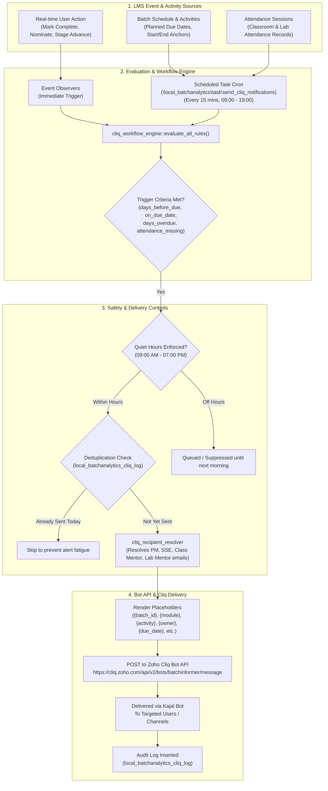

# Kajal Bot – Notification & Escalation Message Templates

**Platform:** Zoho Cliq (Kajal Bot)
**Scope:** Full batch lifecycle – batch start → module / activity events → stage transitions → batch closure
**Status:** DRAFT – for review with Balwant Sir
**Owner of this document:** Deepak

---

## Contents

1. [Overview](#1-overview)
2. [Workflow Architecture & Operational Mechanism](#2-workflow-architecture--operational-mechanism)
   - [2.1 End-to-End Workflow Architecture](#21-end-to-end-workflow-architecture)
   - [2.2 Dual Trigger Mechanisms (Real-Time Hooks vs Scheduled Engine)](#22-dual-trigger-mechanisms-real-time-hooks-vs-scheduled-engine)
   - [2.3 Dynamic Recipient Resolution Matrix](#23-dynamic-recipient-resolution-matrix)
   - [2.4 Condition, Offset & Escalation Evaluation Rules](#24-condition-offset--escalation-evaluation-rules)
   - [2.5 Delivery Controls & Safeguards (Quiet Hours & Deduplication)](#25-delivery-controls--safeguards-quiet-hours--deduplication)
   - [2.6 Interactive Dry-Run Simulation & Testing](#26-interactive-dry-run-simulation--testing)
3. [Lifecycle Pattern](#3-lifecycle-pattern)
4. [Conventions](#4-conventions)
5. [Templates by Recipient](#5-templates-by-recipient)
   - [5.1 Program Manager (PM)](#51-program-manager-pm)
   - [5.2 Student Success Executive (SSE)](#52-student-success-executive-sse)
   - [5.3 Class Mentor](#53-class-mentor)
   - [5.4 Lab Mentor](#54-lab-mentor)
6. [Escalation Matrix](#6-escalation-matrix)
7. [Placeholder Dictionary](#7-placeholder-dictionary)
8. [Open Items for Review](#8-open-items-for-review)

---

## 1. Overview

Every trackable activity in the LMS has a lifecycle. Whenever a mentor, Program Manager (PM), Student Success Executive (SSE) or lab mentor performs an activity in the LMS (or fails to do it on time), the Kajal bot sends the appropriate message on Zoho Cliq.

Each activity type declares:

- an **owner** (the role responsible: Class Mentor, Lab Mentor, or SSE),
- a **due rule** (often a module-relative anchor, e.g. "2 days before module end"),
- an **escalation threshold** (how many days of delay before the Program Manager is notified).

This document details both the **workflow architecture** (how the engine evaluates and triggers alerts) and the complete **catalogue of message templates** grouped by recipient.

---

## 2. Workflow Architecture & Operational Mechanism

### 2.1 End-to-End Workflow Architecture

The notification engine operates as an automated state-machine bridging Moodle LMS batch data with Zoho Cliq:



---

### 2.2 Dual Trigger Mechanisms (Real-Time Hooks vs Scheduled Engine)

The workflow system operates through two distinct evaluation layers:

1. **Real-Time Event Observers (Instant Dispatch):**
   - **Trigger:** Immediate user action in the Moodle web interface.
   - **Examples:**
     - A Class Mentor clicks *"Nominate"* for Spot Award &rarr; `PM-06` fires instantly to the Program Manager.
     - A Mentor marks a trackable activity complete &rarr; `PM-04` fires instantly to confirm completion to PM and Owner.
     - A Program Manager advances the batch to the next module &rarr; `PM-05` and `SSE-02` fire immediately to transition roles and re-anchor upcoming soft-skills activities.
2. **Automated Scheduled Workflow Engine (Periodic Background Polling):**
   - **Trigger:** Moodle Scheduled Task `\local_batchanalytics\task\send_cliq_notifications` registered in `db/tasks.php`.
   - **Frequency:** Runs every **15 minutes** during active business hours (default: `09:00 – 19:00`).
   - **Mechanism:** Iterates over all active batches (`local_bm_classsection` where `status = 'Active'`), fetches all planned course mentor activities (`mentor_activity_service::get_course_mentor_activities`), and computes day variance (`$days_diff = round((due_timestamp - today_midnight) / 86400)`).

---

### 2.3 Dynamic Recipient Resolution Matrix

The bot resolves target emails dynamically at runtime by inspecting LMS batch records and role definitions:

| Recipient Role Key | Target Description | Resolution Source in LMS |
|---|---|---|
| `pm` | **Program Manager** | Reads `local_bm_classsection.pmmanager` email or users assigned the Program Manager role configured in `admin/settings.php`. |
| `sse` | **Student Success Executive** | Reads `local_bm_classsection.maacexecutive` email or users assigned the Student Success Executive role in `admin/settings.php`. |
| `ss_lead` | **Soft Skills Lead** | Reads `sslead_roles` / `sslead_email` in `admin/settings.php`. Escalation and completion notification target for SS activities (PM is excluded). |
| `class_mentor` | **Class Mentor** | Reads `primarymentor` and `secondarymentor` from `local_bm_classsection.moduledata` for the active module, falling back to course editing teacher enrollments. |
| `lab_mentor` | **Lab Mentor** | Reads `labmentor` from `local_bm_classsection.moduledata` for the active module. |
| `assistant_manager` | **Assistant Manager** | Reads users assigned the Assistant Manager role in plugin settings; acts as the second-tier escalation authority. |

---

### 2.4 Condition, Offset & Escalation Evaluation Rules

Every template rule in `local_batchanalytics_cliq_rules` defines a condition metric and days offset `{n}`:

1. **`days_before_due` (Upcoming Deadline Reminder):**
   - *Formula:* `$days_diff == $rule->days_offset` (e.g., `{n} = 1` triggers 1 day before due date).
   - *Target:* Activity Owner (`CM-02`, `LM-02`, `SSE-03`).
2. **`on_due_date` (Due Today Alert):**
   - *Formula:* `$days_diff == 0` (due today midnight).
   - *Target:* Activity Owner (`CM-02`, `LM-02`).
3. **`days_overdue` (Overdue Warning):**
   - *Formula:* `$days_diff < 0` and activity `completed == 0`. Overdue days: `$delay_days = abs($days_diff)`.
   - *Target:* Activity Owner (`CM-03`, `LM-03`, `SSE-04`).
4. **`escalation` (Manager Escalation Threshold):**
   - *Formula:* `$delay_days >= $rule->escalate_days` (default: 2 days overdue).
   - *Target:* **Program Manager** (`PM-02`) and optional **Assistant Manager**.
   - *Action:* Kajal Bot notifies the PM that the mentor was reminded but has failed to submit.
5. **`attendance_missing` (Attendance Compliance):**
   - *Formula:* No finalized attendance record found for today's session by 12:00 PM / 05:00 PM.
   - *Target:* Class Mentor (`CM-05`); escalates to Program Manager (`CM-06`) if missing $\ge 2$ consecutive days.

---

### 2.5 Delivery Controls & Safeguards (Quiet Hours & Deduplication)

To protect staff from alert fatigue and avoid off-hours disturbances:

1. **Quiet Hours Policy:**
   - Default active dispatch window: **09:00 AM to 07:00 PM** (`09:00 - 19:00`).
   - Any scheduled background cron firing outside this window will safely suppress execution until the next business morning.
2. **Intelligent Deduplication:**
   - Every dispatch is recorded in `local_batchanalytics_cliq_log` indexed by `(template_id, batch_id, activity_name, date_sent)`.
   - Before firing an alert, the engine verifies if the exact same template and activity has already been dispatched for that batch today. If yes, it is automatically skipped.
3. **Bot API Payload Compliance:**
   - Follows Zoho Cliq Bot Message API specification (`POST https://cliq.zoho.com/api/v2/bots/{bot_name}/message?zapikey=...`).
   - Formats `userids` as a clean comma-separated string (`"user1@company.com,user2@company.com"` or ZUID string `"889517703"`), or omits `userids` when broadcasting to the bot channel/subscribers.

---

### 2.6 Interactive Dry-Run Simulation & Testing

Before enabling automated dispatches on live batches, administrators and Program Managers can verify the workflow:

1. Navigate to **Site Administration &rarr; Batch Analytics &rarr; Zoho Cliq Templates** (`cliq_templates.php`).
2. Click **⚡ Dry-Run Workflow**:
   - The engine scans all active batches and live mentor activities in memory.
   - Computes planned deadline offsets, checks completed status, and tests escalation thresholds.
   - Displays a full simulation report showing which batches match, the exact recipients resolved, and the rendered message copy without sending any actual messages to Zoho Cliq.
3. Click **🧪 Test Bot Message**:
   - Sends an instant test payload with custom text to your own Cliq ID or the bot subscriber channel to verify API connectivity.

---

## 3. Lifecycle Pattern

```
Due → Notify owner → (Reminder if not done) → Escalate to PM → Owner marks done → Confirmation
```

| Stage | What happens | Template type |
|---|---|---|
| 1. Due | Activity approaches its due date | Activity due |
| 2. Notify owner | Owner is told in advance | Activity due |
| 3. Reminder | Owner has not completed it | Activity due / Activity overdue |
| 4. Escalate | Delay crosses the threshold, PM is told | Escalation |
| 5. Done | Owner marks the activity complete in the LMS | Activity completed |
| 6. Confirmation | Owner and PM get confirmation | Activity completed |

---

## 4. Conventions

| Item | Convention |
|---|---|
| Placeholders | Written as `{placeholder}`; see [Section 6](#6-placeholder-dictionary) |
| Template IDs | `<ROLE>-<NN>` (PM-01, SSE-01, CM-01, LM-01). Same trigger keeps the same suffix logic across roles where possible |
| Severity icons | ℹ️ Info · 🔔 Reminder · ⏰ Overdue · 🚨 Escalation · ✅ Confirmation · 🎉 Milestone |
| Tone | Short, direct, one clear action. Every actionable message ends with what the person must do |
| Links | Every message that needs action ends with `{lms_link}` (deep link to the exact activity or batch page in the LMS) |
| Status tags | **Existing** = from the original catalogue (expanded). **NEW** = proposed addition for course activities / milestones |
| Thresholds | `{n}`, reminder lead time etc. are **configurable per activity type**. Suggested defaults are listed in [Section 5](#5-escalation-matrix) |

---

## 5. Templates by Recipient

### 4.1 Program Manager (PM)

The Program Manager receives batch-level and escalation messages. The PM is the escalation point for every owner role.

| ID | Trigger event | Status | Escalation | Message template |
|---|---|---|---|---|
| PM-01 | Batch created | Existing | — | ℹ️ **New batch created**<br>Batch: {batch_id} ({mode})<br>Course: {course_name}<br>Start date: {start_date} · Planned end: {planned_end}<br>You are assigned as **Program Manager**.<br>View batch: {lms_link} |
| PM-02 | Escalation | Existing | PM is the escalation target | 🚨 **ESCALATION**<br>Activity: {activity}<br>Batch / Module: {batch_id} / {module}<br>Owner: {owner} ({owner_role})<br>Overdue by: {delay_days} day(s)<br>Due date was: {due_date}<br>The owner has been reminded but has not completed this. Please follow up.<br>{lms_link} |
| PM-03 | Schedule slip | Existing | — | ⚠️ **Schedule slip**<br>{batch_id} / {module} is delayed by {delay_days} day(s) vs plan.<br>Planned end: {planned_end} · Revised end: {revised_end}<br>Downstream modules affected: {affected_modules}<br>Review recommended.<br>{lms_link} |
| PM-05 | Stage transition | Existing | — | ℹ️ **Batch stage transition**<br>Dear {pm_name} / {sse_name} / {next_mentor_name},<br>This is to inform you that batch {batch_id} has moved from {previous_module} to {next_module}.<br>The applicable Student Success activities have been re-anchored.<br><br>**Notification Details:**<br>• Batch: {batch_id}<br>• Previous Module: {previous_module}<br>• Next Module: {next_module}<br>• Transition Date: {transition_date}<br>• Class Mentor: {next_class_mentor}<br>• Lab Mentor: {next_lab_mentor}<br><br>**Batch Performance Summary:**<br>• Overall Attendance: {overall_attendance}<br>• MAAC Rating: {overall_maac_rating}<br>• Total Students: {student_count}<br>• Prev Module Completion: {prev_module_completion}<br>• Status: {batch_status}<br><br>Action Required: Review activities and proceed with assigned responsibilities.<br>{lms_link} |
| PM-06 | Nomination raised | Existing | — | 🎉 **Nomination raised**<br>{owner} nominated {count} student(s) for {award_type} in {batch_id}.<br>Nominees: {nominee_names}<br>Approval pending. Please review and approve / reject.<br>{lms_link} |
| PM-07 | Nomination pending too long | NEW | → Reminder to PM | 🔔 **Nomination awaiting your approval**<br>{award_type} nomination in {batch_id} (raised by {owner} on {date}) is pending for {pending_days} day(s).<br>Please approve or reject.<br>{lms_link} |
| PM-08 | Batch closure | Existing | — | 🎉 **Batch completed**<br>{batch_id} completed on {end_date}.<br>Pending closure items:<br>• Closure meeting<br>• Final review<br>Please schedule and complete both by {closure_due_date}.<br>{lms_link} |
| PM-09 | Module completed | NEW | — | ✅ **Module completed**<br>{module} for {batch_id} ended on {actual_end} (planned {planned_end}).<br>Variance: {delay_days} day(s).<br>Pending activities in this module: {pending_count}.<br>{lms_link} |
| PM-10 | Mid-batch review due | NEW | → Escalate if not held | 🔔 **Mid-batch review due**<br>{batch_id} has reached its mid-point ({midpoint_date}).<br>Please schedule the mid-batch review with {reviewers}.<br>{lms_link} |
| PM-11 | Weekly batch digest | NEW | — | ℹ️ **Weekly digest – {batch_id}**<br>Week of {week_start}<br>Current module: {module}<br>Activities done: {done_count} · Due this week: {due_count} · Overdue: {overdue_count}<br>Schedule status: {schedule_status}<br>{lms_link} |
| PM-12 | Repeated overdue by same owner | NEW | — | 🚨 **Repeated delays**<br>{owner} has {overdue_count} overdue activities in {batch_id} (oldest: {oldest_activity}, {delay_days}d).<br>Please discuss with the owner.<br>{lms_link} |

---

### 4.2 Student Success Executive (SSE)

The Student Success Executive receives batch-setup, transition, and closure messages for batches they support.

| ID | Trigger event | Status | Escalation | Message template |
|---|---|---|---|---|
| SSE-01 | Batch created | Existing | — | ℹ️ **New batch assigned**<br>Batch: {batch_id} ({mode})<br>Course: {course_name}<br>Start date: {start_date}<br>You are assigned as **Student Success Executive**.<br>View batch: {lms_link} |
| SSE-02 | Stage transition | Existing | — | ℹ️ **Stage transition**<br>{batch_id} moved from {module} to {next_module}.<br>SS activities have been re-anchored. Please review your upcoming SS activities and due dates.<br>{lms_link} |
| SSE-03 | SS activity due | NEW | → SS Lead at threshold | 🔔 **Reminder:** {activity} for {batch_id} / {module} is due {due_date}.<br>Please complete it in the LMS.<br>{lms_link} |
| SSE-04 | SS activity overdue | NEW | → SS Lead after {n} days (PM excluded) | ⏰ **Overdue:** {activity} for {batch_id} / {module} is overdue by {delay_days} day(s).<br>Complete it now, otherwise it will be escalated to the SS Lead.<br>{lms_link} |
| SSE-05 | Activity completed | NEW | — | ✅ {activity} for {batch_id} / {module} marked done by {owner} on {date}. Sent to SS Executive & SS Lead (PM excluded).<br>{lms_link} |
| SSE-06 | Schedule slip | NEW | — | ⚠️ {batch_id} / {module} is delayed by {delay_days} day(s) vs plan. Your SS activities may be re-anchored.<br>{lms_link} |
| SSE-07 | Batch closure | Existing | — | 🎉 **Batch completed**<br>{batch_id} completed on {end_date}.<br>Closure meeting and final review are due by {closure_due_date}.<br>Please complete your closure inputs.<br>{lms_link} |

---

### 4.3 Class Mentor

The Class Mentor receives module-level and activity-level messages for theory / classroom delivery.

| ID | Trigger event | Status | Escalation | Message template |
|---|---|---|---|---|
| CM-01 | Module assigned / started | Existing | — | ℹ️ **Module Assigned – Class Mentor**<br>Dear {mentor_name},<br>This is to inform you that the {module_name} module for batch {batch_id} has been assigned to you.<br>You are assigned as the **Class Mentor** for this module. Please review the module plan and conduct the scheduled classes within the planned timeline.<br><br>**Notification Details:**<br>• Batch ID: {batch_id}<br>• Module: {module_name}<br>• Actual Start Date: {actual_start_date}<br>• Planned End Date: {planned_end_date}<br><br>Action Required: Review the module plan and proceed with scheduled classes as per the planned timeline.<br>{lms_link} |
| CM-02 | Activity due | Existing | → PM at threshold | 🔔 **Reminder:** {activity} for {batch_id} / {module} is due {due_date}.<br>Please complete it in the LMS.<br>{lms_link} |
| CM-03 | Activity overdue | Existing | → PM after {n} days | ⏰ **Overdue:** {activity} for {batch_id} / {module} is overdue ({delay_days}d).<br>Complete it now, otherwise it will be escalated to the PM.<br>{lms_link} |
| CM-04 | Activity completed | Existing | — | ✅ {activity} for {batch_id} / {module} marked done by you on {date}. Thank you.<br>{lms_link} |
| CM-05 | Stage transition (next mentor) | Existing | — | ℹ️ **You are up next**<br>{batch_id} moved from {module} to {next_module}.<br>You are the mentor for {next_module}, starting {next_start_date}.<br>Please review the module plan and activities.<br>{lms_link} |
| CM-06 | Module ending soon | NEW | — | 🔔 {module} for {batch_id} ends on {planned_end} ({days_left} day(s) left).<br>Pending activities: {pending_activities}.<br>Please complete them before the module closes.<br>{lms_link} |
| CM-07 | Attendance not marked | NEW | → PM after {n} days | 🔔 Attendance for {batch_id} / {module} on {session_date} has not been marked.<br>Please update it in the LMS today.<br>{lms_link} |
| CM-08 | Assessment scheduled | NEW | — | 🔔 **Assessment scheduled**<br>{assessment_name} for {batch_id} / {module} is scheduled on {assessment_date}.<br>Please make sure questions / papers are ready.<br>{lms_link} |
| CM-09 | Assessment evaluation pending | NEW | → PM at threshold | ⏰ Evaluation of {assessment_name} for {batch_id} / {module} is pending ({delay_days}d). Please upload marks / results.<br>{lms_link} |
| CM-10 | Nomination submitted (confirmation) | Existing (confirmation) | — | ✅ Your nomination of {count} student(s) for {award_type} in {batch_id} has been sent to the PM for approval.<br>{lms_link} |
| CM-11 | Nomination approved | NEW | — | 🎉 Your {award_type} nomination in {batch_id} has been **approved** by {approver}.<br>Approved: {approved_names}.<br>{lms_link} |
| CM-12 | Nomination rejected | NEW | — | ℹ️ Your {award_type} nomination in {batch_id} was **not approved** by {approver}.<br>Remarks: {remarks}.<br>You may re-submit with changes.<br>{lms_link} |
| CM-13 | Batch closure | NEW | — | 🎉 {batch_id} was completed on {end_date}. Thank you for your contribution.<br>Please complete any pending feedback / closure inputs by {closure_due_date}.<br>{lms_link} |

---

### 4.4 Lab Mentor

The Lab Mentor receives messages for lab sessions, practicals, and lab-related activities.

| ID | Trigger event | Status | Escalation | Message template |
|---|---|---|---|---|
| LM-01 | Module assigned / started | Existing | — | ℹ️ **Module Assigned – Lab Mentor**<br>Dear {mentor_name},<br>This is to inform you that the {module_name} module for batch {batch_id} has been assigned to you.<br>You are assigned as the **Lab Mentor** for this module. Please review the module plan and conduct the scheduled labs within the planned timeline.<br><br>**Notification Details:**<br>• Batch ID: {batch_id}<br>• Module: {module_name}<br>• Actual Start Date: {actual_start_date}<br>• Planned End Date: {planned_end_date}<br><br>Action Required: Review the module plan and proceed with scheduled labs as per the planned timeline.<br>{lms_link} |
| LM-02 | Activity due | Existing | → PM at threshold | 🔔 **Reminder:** {activity} for {batch_id} / {module} is due {due_date}.<br>Please complete it in the LMS.<br>{lms_link} |
| LM-03 | Activity overdue | Existing | → PM after {n} days | ⏰ **Overdue:** {activity} for {batch_id} / {module} is overdue ({delay_days}d).<br>Complete it now, otherwise it will be escalated to the PM.<br>{lms_link} |
| LM-04 | Activity completed | Existing | — | ✅ {activity} for {batch_id} / {module} marked done by you on {date}. Thank you.<br>{lms_link} |
| LM-05 | Stage transition (next mentor) | Existing | — | ℹ️ **You are up next**<br>{batch_id} moved from {module} to {next_module}.<br>You are the lab mentor for {next_module}, starting {next_start_date}.<br>Please verify lab readiness.<br>{lms_link} |
| LM-06 | Lab readiness check due | NEW | → PM at threshold | 🔔 Lab readiness for {batch_id} / {module} must be confirmed by {due_date} (systems, software, access, datasets).<br>Please update the checklist in the LMS.<br>{lms_link} |
| LM-07 | Lab session attendance not marked | NEW | → PM after {n} days | 🔔 Lab attendance for {batch_id} / {module} on {session_date} has not been marked.<br>Please update it today.<br>{lms_link} |
| LM-08 | Practical / lab assessment evaluation pending | NEW | → PM at threshold | ⏰ Evaluation of {assessment_name} (lab) for {batch_id} / {module} is pending ({delay_days}d).<br>Please upload marks / results.<br>{lms_link} |
| LM-09 | Nomination submitted (confirmation) | Existing (confirmation) | — | ✅ Your nomination of {count} student(s) for {award_type} in {batch_id} has been sent to the PM for approval.<br>{lms_link} |
| LM-10 | Nomination approved / rejected | NEW | — | Use CM-11 / CM-12 templates. |

---

## 6. Escalation Matrix

Suggested defaults, to be confirmed with Balwant Sir. All values are configurable per activity type.

| Activity category | Owner | Reminder before due | Overdue message | Escalate to PM after | Notes |
|---|---|---|---|---|---|
| Module activity (classroom) | Class Mentor | 1 day before and on due date | Daily | {n} = 2 days overdue | Sent via CM-02 / CM-03 / PM-02 |
| Lab activity | Lab Mentor | 1 day before and on due date | Daily | {n} = 2 days overdue | Sent via LM-02 / LM-03 / PM-02 |
| SS activity | SSE | 3 days before and on due date | Daily (at 3 days overdue) | {n} = 5 days overdue | Escalate to **SS Lead + SS Executive (PM Excluded)** via `ss_t_plus_5` |
| Attendance | Class / Lab Mentor | Same-day end-of-day nudge | Next morning | {n} = 1 day overdue | CM-07 / LM-07 |
| Assessment evaluation | Class / Lab Mentor | 1 day before due | Daily | {n} = 2 days overdue | CM-09 / LM-08 |
| Nomination approval | PM | — | Reminder to PM after 2 days pending | — | PM-07 |
| Closure items | PM, SSE | At batch end | Daily | — | PM-08 / SSE-07 |

**Quiet hours:** no bot messages outside {working_hours_start}–{working_hours_end} (reminders are queued for the next working morning). *To be confirmed.*

---

## 7. Placeholder Dictionary

| Placeholder | Meaning | Example |
|---|---|---|
| `{batch_id}` | Batch identifier | B2026-014 |
| `{mode}` | Delivery mode | Online / Offline / Hybrid |
| `{course_name}` | Course name | Full Stack Development |
| `{start_date}` | Batch start date | 05 Oct 2026 |
| `{end_date}` | Actual batch end date | 20 Dec 2026 |
| `{planned_end}` | Planned end date of batch / module | 15 Nov 2026 |
| `{revised_end}` | Revised end date after a slip | 18 Nov 2026 |
| `{role}` | Role assigned to the recipient | PM / SSE |
| `{module}` / `{next_module}` | Module name | Core Java |
| `{actual_start}` / `{actual_end}` | Actual module start / end date | 12 Oct 2026 |
| `{activity}` | Activity name | Weekly assessment report |
| `{activity_count}` / `{lab_activity_count}` | Number of activities in module | 6 |
| `{pending_activities}` / `{pending_count}` | Pending activities (names / count) | 2 |
| `{owner}` / `{owner_role}` | Person / role responsible | Ravi Kumar / Class Mentor |
| `{next_mentor}` | Mentor of the next module | Anita S. |
| `{due_date}` | Due date of activity | 10 Oct 2026 |
| `{delay_days}` | Days overdue / delayed | 3 |
| `{pending_days}` | Days an approval has been pending | 2 |
| `{days_left}` | Days remaining | 2 |
| `{n}` | Escalation threshold in days | 2 |
| `{date}` | Date of the event | 10 Oct 2026 |
| `{session_date}` | Date of class / lab session | 09 Oct 2026 |
| `{count}` | Number of students nominated | 3 |
| `{award_type}` | Award category | Spot Award |
| `{nominee_names}` / `{approved_names}` | Student names | A, B, C |
| `{approver}` | Person who approved / rejected | PM name |
| `{remarks}` | Approver's comments | Needs more evidence |
| `{assessment_name}` | Assessment name | Module 2 Test |
| `{assessment_date}` | Assessment date | 12 Oct 2026 |
| `{affected_modules}` | Modules shifted due to slip | Module 3, Module 4 |
| `{midpoint_date}` | Batch mid-point date | 15 Nov 2026 |
| `{reviewers}` | Review participants | Balwant Sir, SSE |
| `{closure_due_date}` | Deadline for closure items | 27 Dec 2026 |
| `{week_start}` | Start of week for digest | 05 Oct 2026 |
| `{done_count}` / `{due_count}` / `{overdue_count}` | Activity counts | 8 / 3 / 1 |
| `{schedule_status}` | On track / Delayed | On track |
| `{oldest_activity}` | Oldest overdue activity | Lab report |
| `{lms_link}` | Deep link to the relevant LMS page | https://… |

---

## 8. Open Items for Review

To be discussed with **Balwant Sir**:

1. **Spot Award template reference:** the Spot Award format was not available while drafting this document. The templates here follow the original catalogue's format (Trigger event / Recipient / Escalation / Message template) and are expanded with title, details, and next action. Please confirm this matches the Spot Award style, and adjust if needed.
2. **Escalation thresholds:** confirm the default values in [Section 5](#5-escalation-matrix) (reminder lead time, `{n}` days).
3. **Second-level escalation:** if the PM does not act on an escalation, should it go to a higher level (e.g. Balwant Sir / Head)? Not defined in the current catalogue.
4. **NEW templates:** confirm which proposed templates (module completed, attendance, assessment, mid-batch review, weekly digest, repeated delays, nomination approved / rejected) should go live.
5. **Student-facing messages:** the current catalogue covers staff roles only. Decide whether students (e.g. award approval, assessment reminders) should also get Kajal bot messages.
6. **Frequency control:** limit of reminders per day per person to avoid notification fatigue.
7. **Course-specific milestones:** list the key milestones per course (project kickoff, project review, mock interviews, placement readiness) so dedicated templates can be added.

---

*Document version: 0.1 (Draft)*
